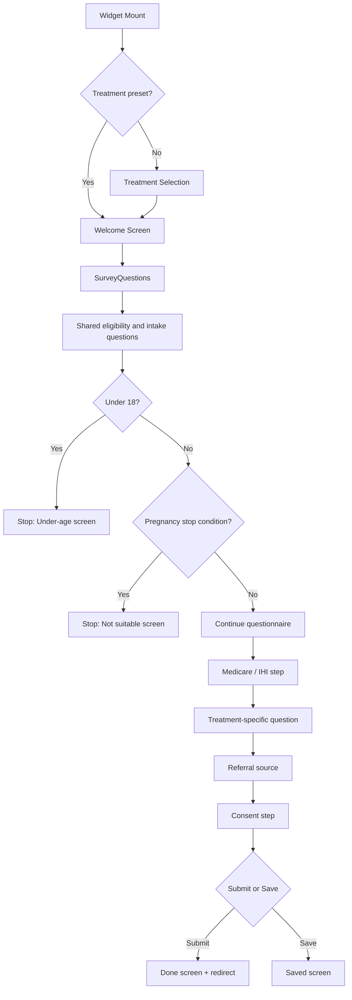
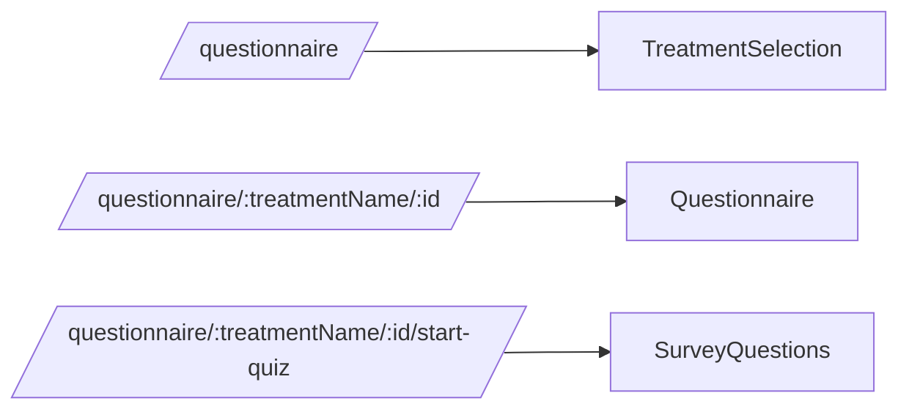
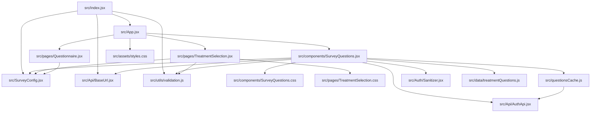

# Primed Questionnaire

Embeddable React questionnaire widget for treatment selection, intake screening, and practitioner handoff.

It supports:
- treatment selection
- a welcome/assessment entry screen
- a conditional multi-step questionnaire
- embedded configuration through `window.SURVEY_CONFIG` or `data-*` attributes
- local automated testing with Vitest and Playwright

## Stack

- React 18
- React Router 6
- Vite for local development
- esbuild via `build.js` for production bundle output
- ESLint for linting
- Vitest + Testing Library for unit tests
- Playwright for end-to-end tests

## Scripts

```bash
npm run start
npm run build
npm run lint
npm run preview
npm run test
npm run test:watch
npm run test:e2e
```

## Project Structure

```text
src/
  index.jsx                     Widget bootstrap and embed config parsing
  App.jsx                       Route wiring
  SurveyConfig.jsx              Runtime styling/config context
  questionsCache.js             Cached questionnaire fetch
  Api/
    AuthApi.jsx                 Axios instance
    BaseUrl.jsx                 Environment-aware base URL helpers
  Auth/
    Sanitizer.jsx               DOMPurify-backed text sanitisation
  components/
    SurveyQuestions.jsx         Main questionnaire flow
    SurveyQuestions.css         Main questionnaire styles
  pages/
    TreatmentSelection.jsx      Treatment picker
    TreatmentSelection.css      Treatment picker styles
    Questionnaire.jsx           Welcome/start screen
  data/
    treatmentQuestions.js       Treatment slug -> question key mapping
  utils/
    validation.js               URL/font/CSS validation helpers

tests/
  e2e/                          Playwright questionnaire flows
  unit/                         Vitest component tests
```

## Runtime Flow

The widget mounts into `#primed-survey` by default and uses a `MemoryRouter`, so it can run safely inside a host page without taking over browser routing.

### Questionnaire Flow Diagram



### Route Diagram



## Dependency Diagram

This is the main runtime dependency shape, not every transitive package.



## Embed Configuration

The widget can be configured either:
- programmatically via `window.SURVEY_CONFIG`
- declaratively via `data-*` attributes on `#primed-survey`

### Minimal Embed

```html
<div id="primed-survey"></div>
<script type="module" src="survey-widget.js"></script>
```

### Start On A Preset Treatment

```html
<div
  id="primed-survey"
  data-treatment-id="1"
  data-treatment-name="weight-loss"
></div>
<script type="module" src="survey-widget.js"></script>
```

### Final Treatment Id Map

Use this slug/id map consistently anywhere treatment choice is saved before the widget loads:

```js
const treatmentIdMap = {
  "muscle-strength-support": 3,
  "anti-ageing": 1,
  "weight-loss": 2,
  "injury-repair-recovery": 4,
  "sexual-health-libido": 5,
  "womens-health": 7,
  "gut-health-immunity": 8,
  "cognitive-health": 9,
  "skin-care": 10
};
```

### External Click Script

Use this on the host page where a treatment card/link is clicked before the questionnaire page loads.

What it does:
- reads `data-treatment-name` from the clicked element
- resolves the id from `treatmentIdMap`
- saves `treatmentName`, `treatmentId`, and `treatmentIdMap` into `sessionStorage`

```html
<script>
(function () {
  "use strict";

  const treatmentIdMap = {
    "muscle-strength-support": 3,
    "anti-ageing": 1,
    "weight-loss": 2,
    "injury-repair-recovery": 4,
    "sexual-health-libido": 5,
    "womens-health": 7,
    "gut-health-immunity": 8,
    "cognitive-health": 9,
    "skin-care": 10
  };

  function handleClick(e) {
    const treatmentName = e.currentTarget.getAttribute("data-treatment-name");
    if (!treatmentName) return;

    const treatmentId = treatmentIdMap[treatmentName];
    if (!treatmentId) {
      console.warn("Unknown treatment name:", treatmentName);
      return;
    }

    try {
      sessionStorage.setItem("treatmentName", treatmentName);
      sessionStorage.setItem("treatmentId", String(treatmentId));
      sessionStorage.setItem("treatmentIdMap", JSON.stringify(treatmentIdMap));
    } catch (err) {
      console.warn("Storage failed:", err);
    }
  }

  document.addEventListener("DOMContentLoaded", function () {
    const links = document.querySelectorAll(
      ".drop-down-goals-item[data-treatment-name], .home-done_blog-list_item-link[data-treatment-name]"
    );

    links.forEach((link) => {
      link.addEventListener("click", handleClick);
    });
  });
})();
</script>
```

Matching clickable elements should use:

```html
<a class="drop-down-goals-item" data-treatment-name="womens-health">Women's Health</a>
```

### External Loader Script

Use this on the page that renders `#primed-survey`.

What it does:
- reads `treatmentName`, `treatmentId`, and `treatmentIdMap` from `sessionStorage`
- passes them onto the widget div as `data-*` attributes
- does not recalculate the id again

```html
<script>
(function () {
  "use strict";

  document.addEventListener("DOMContentLoaded", function () {
    try {
      const treatmentName = sessionStorage.getItem("treatmentName");
      const treatmentId = sessionStorage.getItem("treatmentId");
      const treatmentIdMap = sessionStorage.getItem("treatmentIdMap");

      if (!treatmentName || !treatmentId) return;

      const surveyDiv = document.getElementById("primed-survey");
      if (!surveyDiv) return;

      surveyDiv.setAttribute("data-treatment-name", treatmentName);
      surveyDiv.setAttribute("data-treatment-id", treatmentId);

      if (treatmentIdMap) {
        surveyDiv.setAttribute("data-treatment-id-map", treatmentIdMap);
      }
    } catch (err) {
      console.warn("Error setting treatment attributes:", err);
    }
  });
})();
</script>
```

### Session Keys Used By The Widget

The widget now uses these session keys for treatment selection:
- `treatmentName`
- `treatmentId`
- `treatmentIdMap` (host-side helper; passed through to the div but not used by the React app)

The widget reads treatment values from:
- `data-treatment-name`
- `data-treatment-id`
- `window.SURVEY_CONFIG.treatmentName`
- `window.SURVEY_CONFIG.treatmentId`
- route params `/questionnaire/:treatmentName/:id`
- `sessionStorage.treatmentName`
- `sessionStorage.treatmentId`

Inside the React app:
- `src/index.jsx` reads `treatmentName` / `treatmentId` from embed config to build the initial route
- `src/pages/TreatmentSelection.jsx` reads and persists `treatmentName` / `treatmentId`
- `src/components/SurveyQuestions.jsx` reads and clears `treatmentName` / `treatmentId`

### Submission And Save Progress

The session key is `treatmentId`, but the backend payload field remains `treatment_id`.

This happens in `src/components/SurveyQuestions.jsx`:
- submit uses `buildPayload(answers, true)`
- save progress uses `buildPayload(answers, false)`
- stopped/ineligible flows also use `buildPayload(..., false)`

The payload includes:
- all questionnaire answers by question key
- `treatment_id`
- `is_completed`
- `user_id`
- `ihi_number`

So:
- session/embed naming is `treatmentName` / `treatmentId`
- API naming is still `treatment_id`

### Passing Treatment From Session Storage

Minimal loader example:

```html
<script>
(function () {
  "use strict";

  document.addEventListener("DOMContentLoaded", function () {
    try {
      const treatmentName = sessionStorage.getItem("treatmentName");
      const treatmentId = sessionStorage.getItem("treatmentId");
      if (!treatmentName || !treatmentId) return;

      const surveyDiv = document.getElementById("primed-survey");
      if (!surveyDiv) return;

      surveyDiv.setAttribute("data-treatment-name", treatmentName);
      surveyDiv.setAttribute("data-treatment-id", treatmentId);
    } catch (err) {
      console.warn("Error setting treatment attributes:", err);
    }
  });
})();
</script>
```

### Programmatic Config

```html
<script>
  window.SURVEY_CONFIG = {
    treatmentId: "1",
    treatmentName: "weight-loss",
    submitBtnClass: "btn btn-primary",
    navBtnClass: "btn btn-outline-secondary",
    inputClass: "my-input",
    labelClass: "my-label",
    questionFont: "'Inter', sans-serif",
    answerFont: "'Inter', sans-serif",
    medicareCardImageUrl: "https://example.com/medicare-card.png",
    dashboardUrl: "https://app.example.com/patient/dashboard",
    styles: ".my-input { border-radius: 16px; }",
  };
</script>
<div id="primed-survey"></div>
<script type="module" src="survey-widget.js"></script>
```

## Development Notes

### Local Development

`vite.config.js` includes a dev-only mock API for:
- `GET /api/initial-questionnaire`
- `POST /api/register/complete`

That means the questionnaire can be exercised locally without a live backend.

### Production Build

Use:

```bash
npm run build
```

This runs `node build.js`, which outputs:

```text
dist/questionnaire.js
```

The production build is handled with esbuild rather than Vite library mode to keep the bundle single-file and avoid CommonJS interop issues.

## Testing

### Unit Tests

Unit tests live under `tests/unit/` and currently cover key questionnaire behaviour such as:
- Medicare warning display
- disabled Continue state
- Medicare length validation

Run:

```bash
npm run test
```

### End-to-End Tests

Playwright tests live under `tests/e2e/` and cover:
- welcome/start flow
- all shared questionnaire questions
- all treatment-specific question branches
- under-18 stop flow
- pregnancy stop flow
- consent and submission flow

Run:

```bash
npm run test:e2e
```

## Active Runtime Dependencies

### App dependencies

- `axios`
- `bootstrap`
- `date-fns`
- `dompurify`
- `lucide-react`
- `react`
- `react-datepicker`
- `react-dom`
- `react-router-dom`

### Dev and test dependencies

- `@playwright/test`
- `@testing-library/dom`
- `@testing-library/jest-dom`
- `@testing-library/react`
- `@testing-library/user-event`
- `@vitejs/plugin-react`
- `eslint`
- `eslint-plugin-react-hooks`
- `eslint-plugin-react-refresh`
- `globals`
- `jsdom`
- `vite`
- `vite-plugin-css-injected-by-js`
- `vitest`

## Current Entry Points

- `src/index.jsx` bootstraps the widget
- `src/App.jsx` wires the in-widget routes
- `src/pages/TreatmentSelection.jsx` handles treatment selection
- `src/pages/Questionnaire.jsx` handles the welcome screen
- `src/components/SurveyQuestions.jsx` handles the full intake flow

## Notes

- The widget now inherits host-page fonts by default unless `--primed-font-*` tokens are provided.
- The old signup/address-lookup flow and its unused assets have been removed.
- The repository includes `test-embed.html` as a manual local harness for embed testing.
